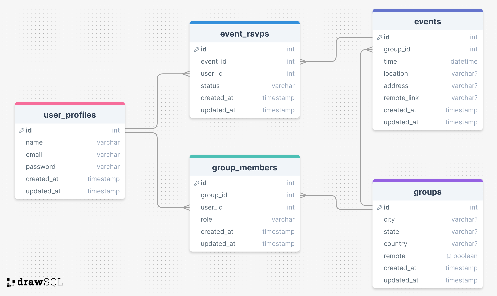

# The Learning Club

## Overview
The Learning Club brings curious people together to learn and connect. 

### Problem
Talented creators have produced countless engaging resources across a range of mediums for adults to continue recreational learning. However, this type of recreational learning is often a solo activity. With the Learning Club this no longer needs to be the case. Each month we'll collect fun and easy to consume resources for you to learn about a new topic. Then you can find a group and chat with them about what you learned, your favourite new facts, and more!

### User Profile
Curious adults looking to expanding or deepen their social circles through a common love of learning.
The initial offering will target English-speaker located within Canada or the USA.

### Features
As a user, I can peruse a landing page overview explaining what the Learning Club is all about.
As a user, I can see what groups are available for me to join.
As a user, I can create an account.
As a signed up user, I can sign into my account
As a signed in user, I can join a group.
As a signed in user, I see the groups I am a part of.
As a signed in user, I can see the next relevant event for me.
As a signed in user, I can RSVP to an upcoming event.
As a signed in user, I can update my RSVP for an event.
As a signed in user, I can see the resources for the month.

## Implementation

### Tech Stack

- React
- Node.js
- Express
- MySQL
- Client libraries: 
    - saas
    - react
    - react-router
    - axios
- Server libraries:
    - express
    - cors
    - knex
    - mysql2
    - bcrypt
    - jsonwebtoken
    - dotenv

### APIs

- No external APIs will be used for the first sprint

### Sitemap

- Home
- List of groups
- Dashboard with learning materials + user groups & events
- Sign up
- Login

### Mockups
-

### Data


### Endpoints

**POST /users/signup**

- Add a user account

Parameters:

- name: User's name
- email: User's email
- password: User's provided password

Response:
```
{
    "token": "seyJhbGciOiJIUzI1NiIsInR5cCI6IkpXVCJ9.eyJzdWIiOiIxMjM0NTY3ODkwIiwibmFtZSI6I..."
}
```

**POST /users/signin**

- Login a user

Parameters:

- name: User's name
- email: User's email
- password: User's provided password

Response:
```
{
    "token": "seyJhbGciOiJIUzI1NiIsInR5cCI6IkpXVCJ9.eyJzdWIiOiIxMjM0NTY3ODkwIiwibmFtZSI6I..."
}
```

**GET /groups**

- Get list of groups ordered alphabetically by location name with the option to filter by location and remote status

Parameters:
- state: selected from fixed drop down (optional if remote is true)
- remote: can be set to true or false
- token: JWT of the logged in user (optional if user is logged in)

Response (ordered by city name asc):
```
[
    {
        "id": 1,
        "city": "Halifax",
        "state": "Nova Scotia",
        "country": "Canada",
        "remote": false,
        "joined": false (optional if user is logged in)
    },
    ...
]
```

**POST /groups/:id/members**

- Create a new relationship with a user and a group

Parameters:
- id: Group id as a number
- token: JWT of the logged in user

Response:
```
[
    {
        "id": 1,
        "group_id": "1",
        "role": "member"
    }
]
```

**GET /profiles**

- Get the profile details of a logged in user for display

Parameters:
- token: JWT of the logged in user

Response:
```
[
    {
        "name": "Name"
    }
]
```


**GET /profiles/groups**

- Get the groups a logged in user has joined

Parameters:
- token: JWT of the logged in user

Response:
```
[
    {
        "id": 1,
        "city": "Halifax",
        "remote": false,
    }
    ...
]
```

**GET /profiles/events**

- Get the upcoming events for group that a logged in user has joined

Parameters:
- token: JWT of the logged in user

Response:
```
[
    {
        "id": 1,
        "eventTime": ""
        "location": "Cafe",
        "address": "123 Main St.",
        "remoteLink": null,
        "response": "attending"
    }
    ...
]
```

**POST /events/:id/rsvps**

- Add a new event attendance response for a logged in user

Parameters:
- status
- token: JWT of the logged in user

Response:
```
[
    {
        "id": 1,
        "event_id",
        "status": "attending"
    }
    ...
]
```

**PUT /events/:id/rsvps/:id**

- Update the event attendance response for a logged in user

Parameters:
- status
- token: JWT of the logged in user

Response:
```
[
    {
        "id": 1,
        "event_id",
        "status": "not attending"
    }
    ...
]
```

### Auth

- JWT auth
    - Store JWT in localStorage, remove when a user logs out
    - Add states for logged in showing different UI in places listed in mockups

## Roadmap

- Create client
    - Creact react project and install dependencies
    - Add core variables, mixins, and global styles
    - Add routes and boilerplate pages
- Create server
    - Create express project with routing
- Create migrations and seed data
    - Create database and migrations
    - Create groups seed data representing the major cities across NA along with 4 remote options across different timezones
    - Create events seed data for each group representing a monthly event for July, August, and September
- Feature: Sign up
    - Add basic sign up form
    - Create POST /users/signup
- Feature: Login
    - Add basic login form
    - Create POST /users/signin
- Feature: Implement JWT tokens
    - Store JWT in local storage and add a check for it
    - Setup the backend to provide JWT
    - Setup the backend function to parse JWT when included in an API call
- Feature: Discover groups
    - Add simple list of groups
- Feature: Join group
    - Add simple list of groups
- Feature: View relevant events
    - Add frontend widget to show list of group events
    - Create GET /profiles/events
- Feature: RSVP to event
    - Provide frontend button to rsvp
    - Create POST /events/:id/rsvps
    - Provide frontend button to update rsvp
    - Create PUT /events/:id/rsvps/:id
- Feature: View monthly resources
    - Showcase resources for the month on the frontend
- Style components throughout workflows
- Style layouts throughout workflows
- Feature: Home page
    - create a discovery workflow for users who are not signed up to 
- Bug fixes and visual enhancements

## Nice-to-haves

- Integrate Google Places/Maps to provide improved UX around club discovery
- Option for users to launch their own groups and events
- Integrate a calender library with a stronger overview of available events
- Provide ability for users to add events to their own calendars
- Option for users to receive email notifications about new or upcoming events
- Ability to suggest and/or vote on topics for upcoming months